# 🛡 CDR Forensic Platform

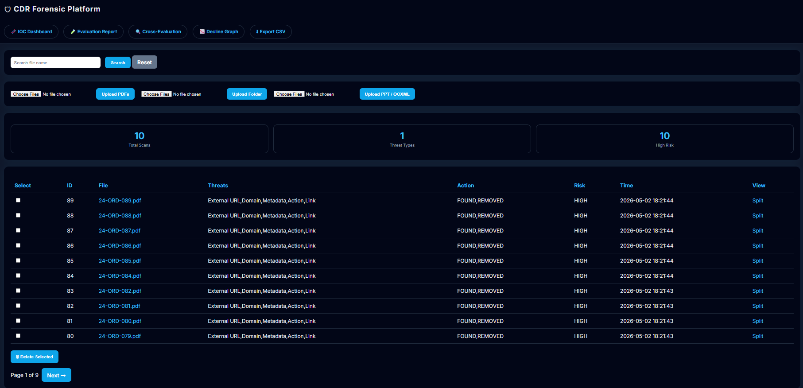
A **Content Disarm & Reconstruction (CDR)** based forensic system for detecting, analyzing, and neutralizing threats in **PDF and OOXML documents (PPT, DOCX, XLSX)**.

This platform performs **static analysis, IOC extraction, and secure sanitization**, while providing a **forensic dashboard for investigation and reporting**.

---

# 📌 1. What This System Actually Does

This system:

- Scans uploaded documents for **active and passive threats**
- Extracts:
  - External URLs
  - Domains
  - IP addresses

- Removes:
  - JavaScript
  - Embedded objects
  - External relationships
  - Dangerous PDF actions

- Generates:
  - Sanitized files
  - Threat logs
  - Risk classification

- Displays everything in a **forensic dashboard**

👉 All processing is **non-execution based (safe analysis)**

---

---

## 📂 Project Structure

The project is organized into logical components for processing, storage, and visualization:

```text
cdr-forensic-platform/
│
├── app.py                # Main Flask application (routes + UI rendering)
├── db.py                 # Database schema, tables, and views
├── sanitizer.py          # Core CDR engine (PDF + OOXML processing)
│
├── requirements.txt      # Python dependencies
├── README.md             # Project documentation
├── .gitignore            # Ignored files
│
├── data/                 # Runtime-generated directory
│   ├── uploads/          # Original uploaded files
│   ├── sanitized/        # Sanitized output files
│   └── db/
│       └── cdr.db        # SQLite database
│
├── graphs/               # Generated analytical graphs (matplotlib output)
│   ├── attack_surface_decline.png
│   └── threat_neutralization.png
```

### 🔹 Notes

- The `data/` folder is **automatically created at runtime**
- The `graphs/` folder stores generated visualization outputs
- No manual setup is required for these directories

---

# 📌 2. Internal Working (Based on Code Logic)

## 🔹 File Processing Flow

1. File uploaded → saved to `data/uploads`
2. SHA256 computed → avoids duplicate scans
3. IOC extraction from raw bytes (URL + IP regex)
4. Threat scoring applied:
   - JavaScript → High
   - Embedded objects → High
   - Links → Medium

5. Sanitization:
   - PDF → pikepdf object removal
   - OOXML → ZIP extraction + XML cleaning

6. Clean file saved to `data/sanitized`
7. Data stored in:
   - `scans` table
   - `detections` table

8. Dashboard reads from **`cdr_logs` view (aggregated)**

---

# 📌 3. Dashboard (Detailed Explanation)

## 🔹 Main Dashboard (`/`)

### 📊 Top Stats Section

- **Total Scans** → number of displayed records
- **Threat Types** → unique detection types
- **High Risk** → count of HIGH-risk files

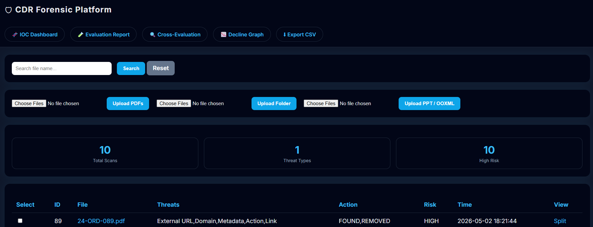

---

## 🔹 Search System

- Uses SQL:

```sql
WHERE original_filename LIKE '%search%'
```

- Works with pagination

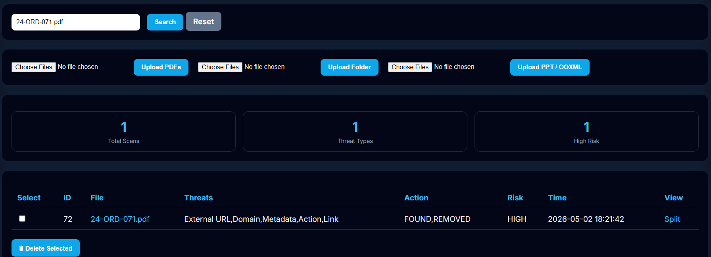

---

## 🔹 Upload Section

Supports 3 modes:

| Type          | Route            |
| ------------- | ---------------- |
| PDF upload    | `/upload`        |
| Folder upload | `/upload-folder` |
| PPT / OOXML   | `/upload-ppt`    |

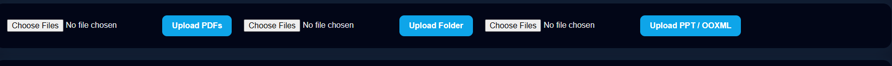

---

## 🔹 Scan Table (Core Component)

Each row comes from `cdr_logs` view:

| Column  | Meaning                    |
| ------- | -------------------------- |
| ID      | Scan ID                    |
| File    | Original file              |
| Threats | Aggregated detection types |
| Action  | FOUND / REMOVED            |
| Risk    | LOW / MEDIUM / HIGH        |
| Time    | Scan timestamp             |

## 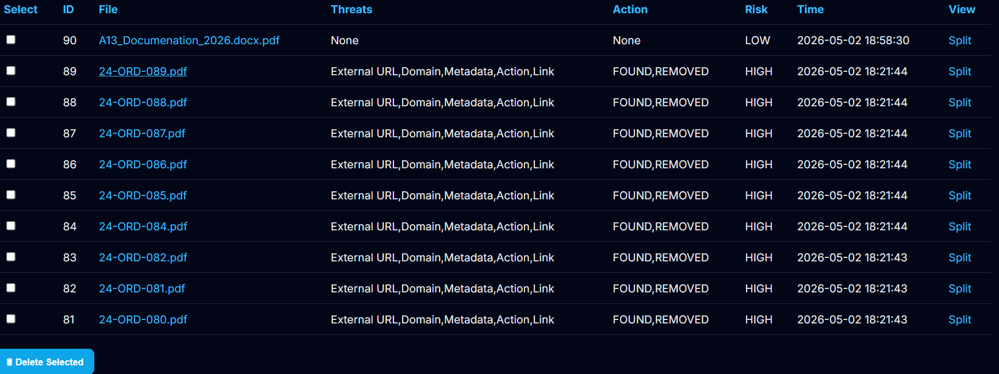

## 🔹 Bulk Delete

- Checkbox per row
- Deletes:
  - File from disk
  - DB entries (scans + detections)

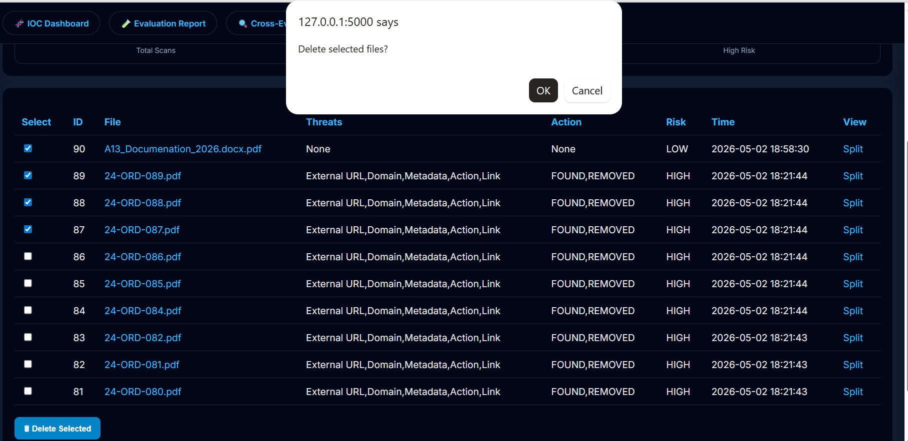

---

## 🔹 Pagination

- 10 rows per page
- Uses:

```sql
LIMIT ? OFFSET ?
```


---

# 📌 4. Scan Detail Page (`/scan/<id>`)

Shows:

- File name
- Risk level
- SHA256 hash
- Total score
- Detailed detections:

| Item | Location | Reason | Score | Action |

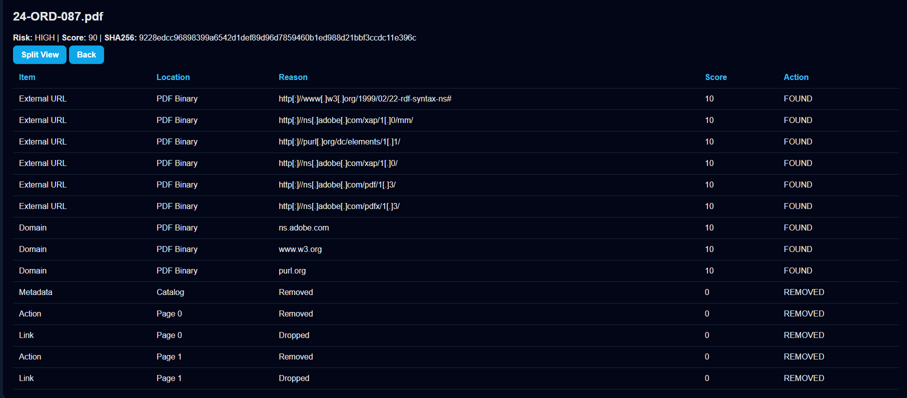

---

# 📌 5. Split View (PDF Only)

Route: `/split/<id>`

Displays:

- Left → Original PDF
- Right → Sanitized PDF

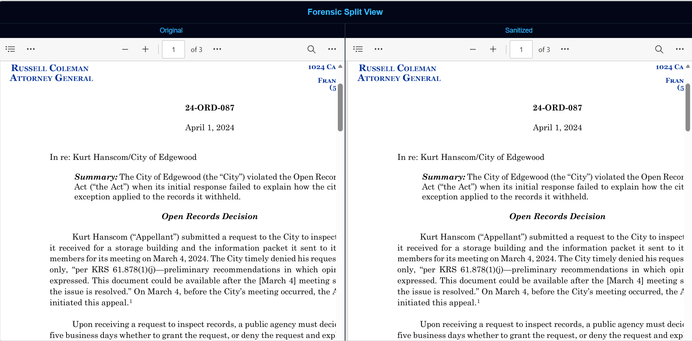

---

# 📌 6. IOC Dashboard (`/ioc`)

Extracted from:

- `domains`
- `ips`

Displays frequency count using aggregation

## 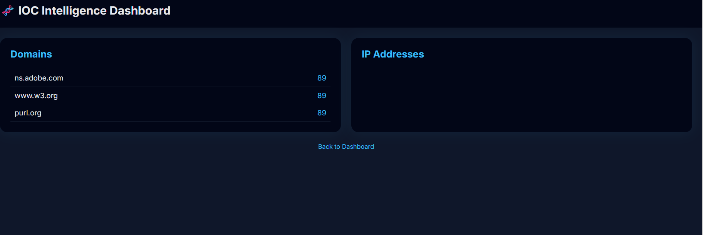

# 📌 7. Evaluation Report (`/evaluation`)

Based on detection logic:

- **Before CDR** = Found + Removed
- **After CDR** = Found
- **CDR Effectiveness** = Removed / Total

Also shows:

- IOC count
- Final risk
- Delivery decision:
  - TRUSTED
  - CAUTION
  - BLOCKED

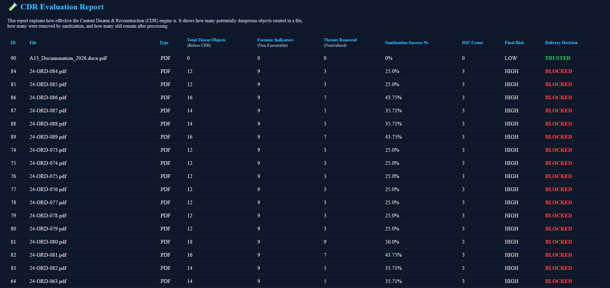

---

# 📌 8. Cross Evaluation (`/cross-evaluation`)

Compares your system with **industry CDR behavior**

Examples:

- Macro removal ✔
- JS removal ✔
- Embedded objects removal ✔

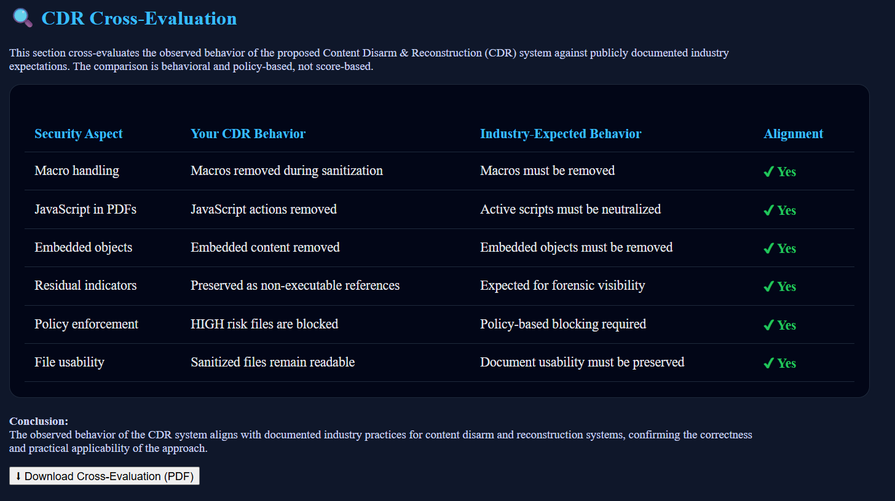

---

## 📊 9. Graph-Based Analysis (`/decline`)

The platform generates **visual forensic insights** using server-side plotting.

Two analytical graphs are produced for each scan sequence:

### 🔹 Attack Surface Reduction

- Compares:
  - Total threat objects **before sanitization**
  - Remaining non-executable indicators **after sanitization**

- Demonstrates how CDR reduces exploitable content while preserving forensic visibility

### 🔹 Threat Detection vs Neutralization

- Shows:
  - Number of threats detected
  - Number of threats successfully removed

- Validates effectiveness of the sanitization engine

These graphs are:

- Generated dynamically using **matplotlib**
- Stored as image files
- Available for **download and reporting**

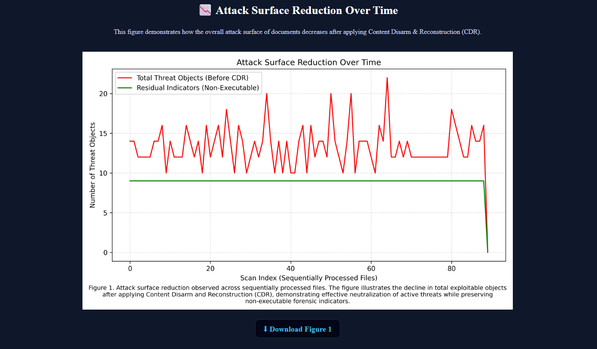
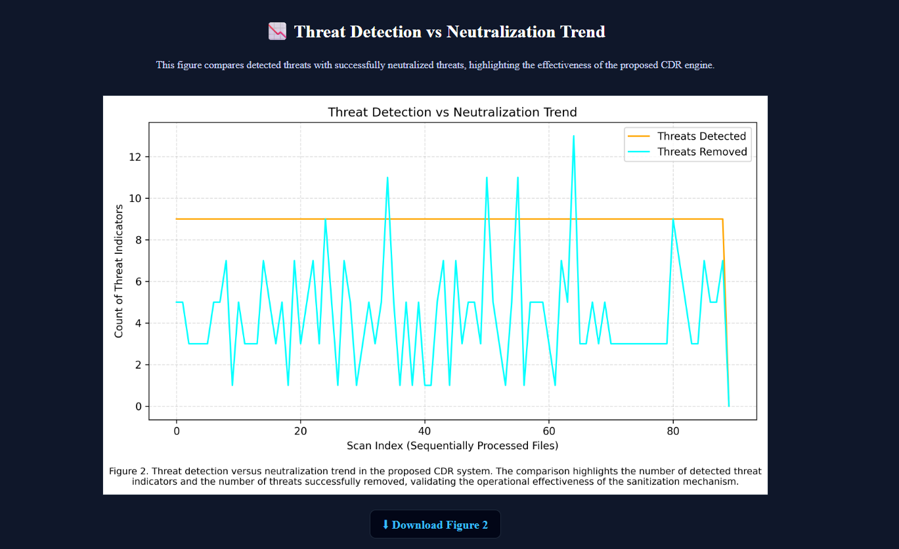

---

## 📤 10. Data Export

The system provides structured export functionality for external analysis.

### Available Export Endpoints

- `/export`
  → Exports complete scan logs

- `/evaluation/download`
  → Exports evaluation report with CDR metrics

### Exported Data Includes

- File metadata
- Detected threats
- Actions taken (FOUND / REMOVED)
- Risk classification
- CDR effectiveness metrics

👉 Output format: **CSV (analysis-ready)**

## 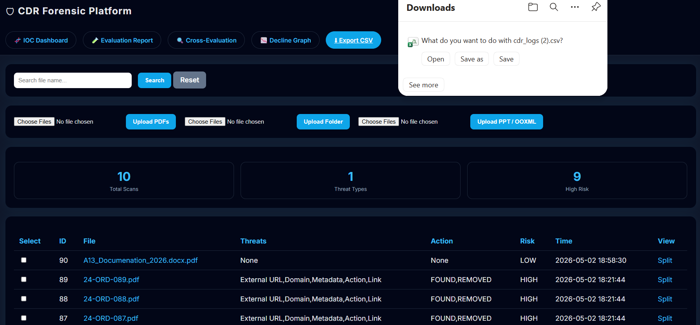

## ⚙️ 11. Installation & Usage

Follow these steps to run the project locally.

### 🔹 Clone Repository

```bash id="c9q8aj"
git clone https://github.com/Kamalhas2005/cdr-forensic-platform.git
cd cdr-forensic-platform
```

---

### 🔹 Create Virtual Environment

```bash id="wz7r4h"
python -m venv .venv
```

Activate environment:

```bash id="2xrm4c"
.\.venv\Scripts\activate
```

---

### 🔹 Install Dependencies

```bash id="f2u5m1"
python -m pip install -r requirements.txt
```

---

### 🔹 Run Application

```bash id="3kqk6g"
python app.py
```

---

### 🔹 Access Dashboard

```text id="zxv4ml"
http://127.0.0.1:5000
```

---

## 📊 Dataset & Testing Environment

This project was evaluated using publicly available document samples and controlled testing environments.

- Sample files (PDF and OOXML formats) were sourced from datasets available on Kaggle
- Approximately **80–90 files** were analyzed to validate system behavior across multiple threat scenarios
- Testing was performed inside a **VMware-based isolated environment** to ensure safe handling of potentially malicious documents

This setup allowed controlled experimentation with:

- Embedded objects
- External links and IOCs
- Script-based threats
- Document structure manipulation

👉 Ensures both **safety** and **realistic threat evaluation**

## 📁 12. Runtime Directory Structure

The system dynamically creates the following structure:

```text id="7o2o2t"
data/
├── uploads/       # Original uploaded files
├── sanitized/     # Cleaned output files
├── db/            # SQLite database (cdr.db)
```

- All paths are **portable and environment-independent**
- No hardcoded system paths are used

---

## 🔐 13. Security Design Principles

This platform follows **safe analysis and reconstruction principles**:

- **No file execution** — all analysis is static
- **Content disarm approach** — removes risky elements instead of detecting only
- **URL defanging** — prevents accidental interaction with malicious links
- **Evidence preservation** — retains non-executable indicators for forensic use
- **Zero-day resilience** — not dependent on signature-based detection

---

## 💡 14. Key Strengths

This project demonstrates a combination of:

- **Security Engineering**
  → Threat detection + sanitization pipeline

- **Digital Forensics (DFIR)**
  → IOC extraction + structured evidence logging

- **Backend System Design**
  → Database-driven architecture with aggregation views

- **Scalable Dashboard Design**
  → Search, pagination, and bulk operations

- **Multi-format Handling**
  → Supports both PDF and OOXML formats

---

## 🚧 15. Future Improvements

Potential extensions for production-level deployment:

- 🔐 User authentication and access control
- ☁️ Cloud deployment (SaaS model)
- 🤖 Machine learning-based threat classification
- 🌐 REST API for integration with other systems
- 📊 Advanced analytics and reporting

---

## 👨‍💻 Author

**Kamalhas Chikudu**  
🔗 https://github.com/Kamalhas2005

---

## ⭐ Final Note

This project demonstrates practical implementation of:

- Content Disarm & Reconstruction (CDR)
- Secure document processing
- Forensic data analysis

If you found this project useful, consider ⭐ starring the repository.
